# Verbis Architecture (C4)

Related: [DOMAIN](DOMAIN.md) · [SCRIPT_MODEL](SCRIPT_MODEL.md) · [SECURITY](SECURITY.md) · [PROGRESS](PROGRESS.md) · [CLAUDE.md](../CLAUDE.md)

## 1. Principles

1. **Core first.** Three primitives — `Box` (layout/container), `Button` (action trigger), `WebService` (data source/integration) — form the kernel. Every screen component is a composition on top ([SCRIPT_MODEL](SCRIPT_MODEL.md)).
2. **Adapters at every edge.** CTI/channel platforms are reached only through `@verbis/sdk-connector` adapters ([ADR-0008](adr/0008-adapter-based-connectors.md)).
3. **Server owns secrets and trust.** Browser holds no tokens ([ADR-0004](adr/0004-bff-auth.md)) and no credentials; screens open only via secure launch ([SECURITY §4](SECURITY.md)).
4. **Events as the spine.** State changes publish events over NATS JetStream ([ADR-0005](adr/0005-nats-event-bus.md)); audit, analytics and realtime are consumers.
5. **Tenant isolation by construction.** `tenant_id` everywhere + PostgreSQL RLS + tenant-scoped crypto keys.
6. **Deploy anywhere.** Same containers run SaaS (Kubernetes, multi-AZ) and on-prem (Helm / docker-compose bundle).

## 2. Level 1 — System Context

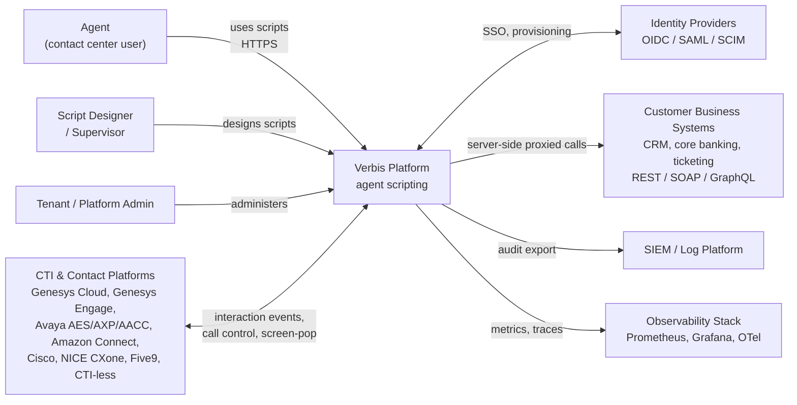

## 3. Level 2 — Containers

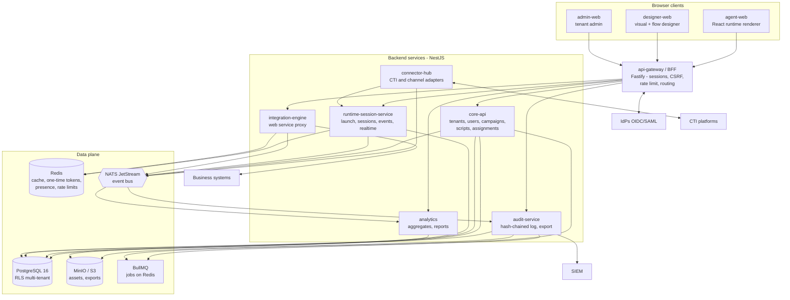

### Container responsibilities

> Containers are logical boundaries. [ADR-0009](adr/0009-workspace-layout.md) maps them to workspaces: core-api, runtime-session-service, integration-engine, audit-service and analytics start as modules of `apps/api` and are extracted later.

| Container | Responsibility | Owns data |
|---|---|---|
| **api-gateway / BFF** (runs in `apps/api` `modules/identity` until extracted, [ADR-0012](adr/0012-identity-module.md)) | OIDC/SAML login termination, httpOnly SameSite session cookies, CSRF, CORS, rate limiting, request signing to internal services, tenant resolution (host/subdomain), SSE/WebSocket fan-in | session store (Redis) |
| **core-api** | Tenants, users, roles, IdPs, SCIM endpoints, campaigns, scripts, versions, assignments, variables, secrets metadata, designer collaboration backend | Postgres core schema |
| **runtime-session-service** | Launch intent issue/redeem, runtime sessions, session events, variable state, multi-channel concurrent sessions, assignment resolution at launch | sessions, events |
| **integration-engine** | Executes `WebService` calls (REST/SOAP/GraphQL), secret injection, SSRF guard, caching, retries, circuit breaker, response mapping/redaction | request logs (redacted), cache |
| **connector-hub** | Hosts adapters, normalizes platform events to Verbis `InteractionEvent`, exposes commands (hold, transfer, disposition) back to platform | connector config, adapter state |
| **audit-service** | Consumes audit events, appends hash chain, search API, verify API, SIEM export (syslog/CEF/JSON, S3, webhook) | audit store |
| **analytics** | Consumes session events, aggregates (script usage, outcomes, A/B), reports | analytics schema |
| **designer-web** | Drag-drop screen designer, flow designer, rule builder, visual debugger, diff, real-time co-editing UI | — |
| **agent-web** | Runtime renderer for scripts; embedded in CTI client (iframe/side panel) or standalone | — |
| **admin-web** | Tenant admin: users, roles, IdPs, SCIM, connectors, secrets, audit explorer, SIEM config | — |

## 4. Level 3 — Components

### 4.1 core-api

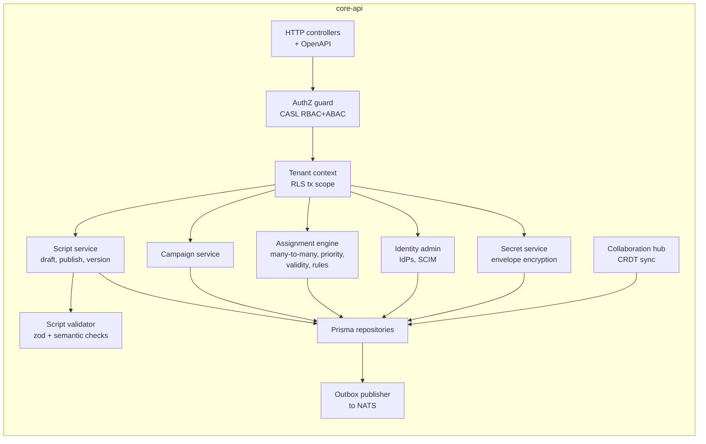

### 4.2 integration-engine

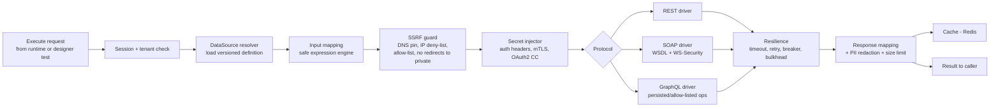

### 4.3 runtime-session-service

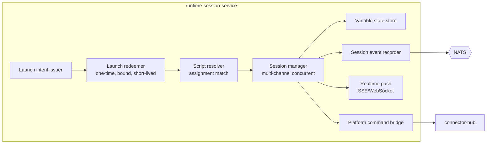

### 4.4 connector-hub

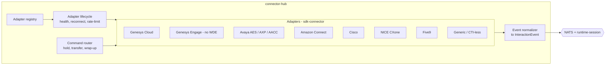

### 4.5 Front-end structure

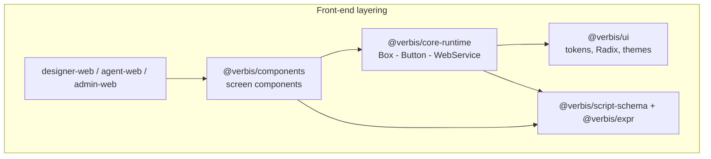

## 5. Key runtime flows

### 5.1 Secure launch (summary; full design in [SECURITY §4](SECURITY.md))

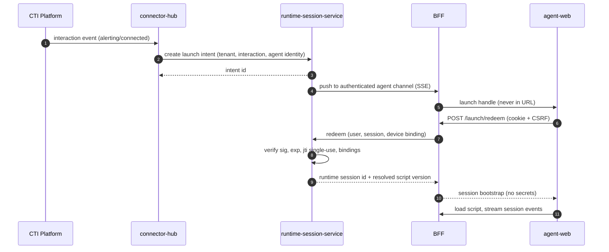

### 5.2 WebService call from a screen

```mermaid
sequenceDiagram
    autonumber
    participant UI as agent-web (Button click)
    participant GW as BFF
    participant IE as integration-engine
    participant BIZ as Business system
    UI->>GW: POST /v1/runtime/sessions/{id}/data-sources/{dsId}/execute {inputs}
    GW->>IE: signed internal call (tenant, session, user)
    IE->>IE: authorize, map inputs, SSRF guard, inject secrets
    IE->>BIZ: REST / SOAP / GraphQL
    BIZ-->>IE: response
    IE->>IE: redact, map, size-limit, cache
    IE-->>UI: mapped result only
    IE-)NATS: datasource.executed event (redacted)
```

### 5.3 Audit pipeline

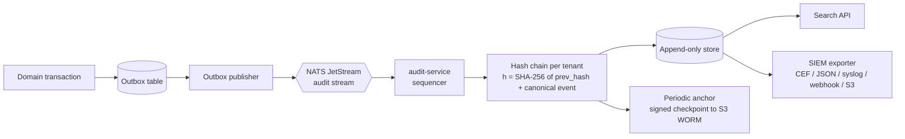

## 6. Deployment

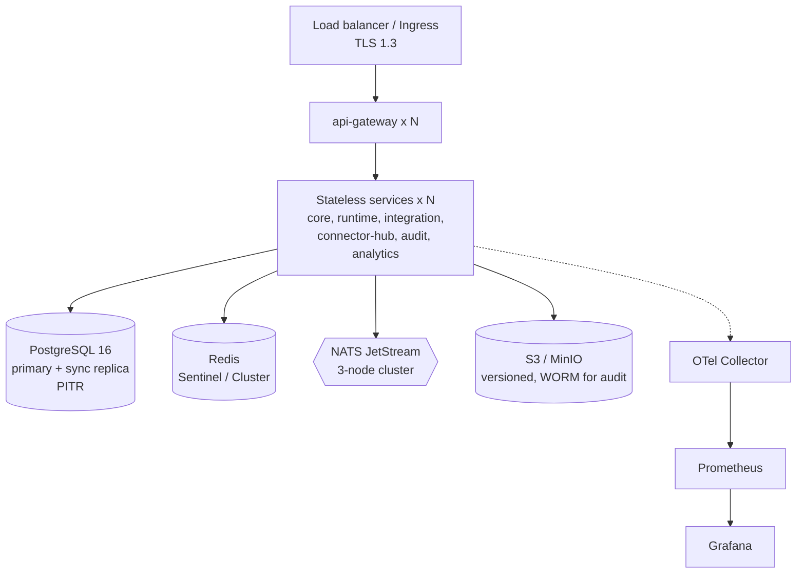

- **Cloud:** Kubernetes multi-AZ, HPA, PodDisruptionBudgets, managed Postgres/Redis optional.
- **On-prem:** Helm chart and docker-compose bundle; no external SaaS dependency; air-gap capable (offline image bundle).
- **HA targets:** 99.95% monthly, RPO ≤ 1 min, RTO ≤ 15 min; zero-downtime migrations (expand/contract).
- **Tenancy:** shared schema + RLS by default; dedicated-DB tier for regulated tenants. Per-tenant data keys (envelope encryption, KMS/Vault).
- **Residency:** region-pinned tenant placement for KVKK/GDPR.

## 7. Cross-cutting

| Concern | Approach |
|---|---|
| AuthN | OIDC/SAML at BFF; service-to-service mTLS + signed internal JWT (short TTL, audience-bound) |
| AuthZ | CASL abilities from RBAC roles + ABAC attributes (campaign, team, queue, data classification) |
| Observability | OTel traces across HTTP/NATS (W3C trace context), Prometheus RED metrics, pino JSON logs with redaction |
| Resilience | Timeouts everywhere, retries only for idempotent ops, circuit breakers, bulkheads, DLQ |
| Config | 12-factor env + typed config schema (zod); secrets from Vault/KMS/K8s secrets |
| Compliance | PII tagging, retention policies, DSAR export/erase tooling, PCI scope reduction (no PAN storage; masked/tokenized fields, pause-and-resume for payment capture) |
| API versioning | `/v1` URL; script `schemaVersion` with migrators ([SCRIPT_MODEL](SCRIPT_MODEL.md)) |

See also: [ADR index](adr/) and [COMPETITIVE](COMPETITIVE.md) for differentiators mapped to these components.

## Team authoring lifecycle

Designer uses the core API for review, immutable release-head rollback, assignments, signed
package dependencies and comments. Hocuspocus shares Yjs documents through the same-origin
WebSocket proxy; Redis leases fence HTTP autosave and lifecycle transitions. Snapshots and audit
commit in the tenant transaction. BullMQ delayed publication refreshes requester permissions and
regression gates. See [ADR-0028](adr/0028-lifecycle-collaboration-and-package-v2.md) and
[setup guide](DESIGNER_LIFECYCLE.md).
