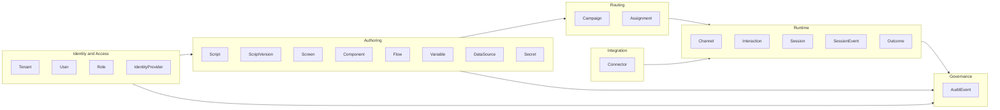
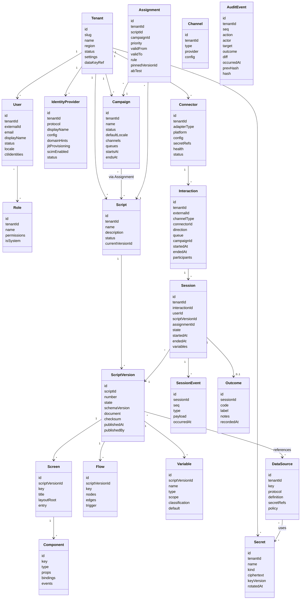
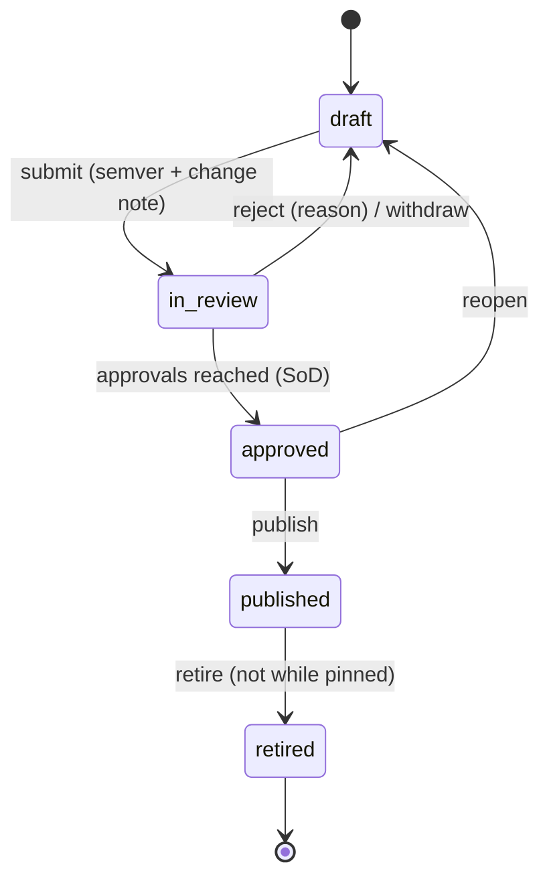
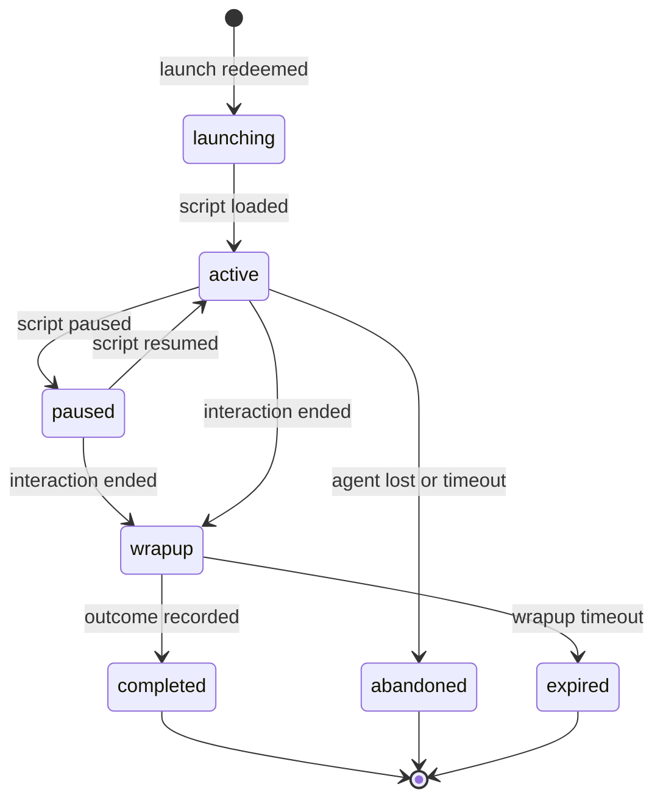

# Verbis Domain Model

Related: [ARCHITECTURE](ARCHITECTURE.md) · [SCRIPT_MODEL](SCRIPT_MODEL.md) · [SECURITY](SECURITY.md) · [CLAUDE.md](../CLAUDE.md)

Conventions: every entity has `id` (UUIDv7), `tenantId` (except `Tenant`), `createdAt`, `updatedAt`, `createdBy`. Soft-delete via `deletedAt` where noted; audit trail is authoritative for history. Fields tagged **[pii]**, **[secret]**, **[pci]** drive redaction.

## 1. Context map

## 2. Class diagram

## 3. Entities

### Tenant
Isolation boundary and billing/config root. `region` pins data residency; `dataKeyRef` points to the tenant's KMS key (envelope encryption). `settings`: default locale/theme, session timeouts, password/MFA policy hints, retention policies, allowed web service egress hosts. Status: `provisioning | active | suspended | deleting`.

### User
Agent, designer, supervisor, or admin. Source: SSO JIT or SCIM. `externalId` is the IdP subject / SCIM `externalId`. `ctiIdentities` maps the user to platform identities (e.g. Genesys userId, Avaya agent id/extension) — **this mapping is what binds launches to users** ([SECURITY §4](SECURITY.md)). Email/displayName are **[pii]**. Deprovisioning (SCIM `active=false`) immediately revokes sessions.

### Role
Named permission set (RBAC). System roles: `tenant_admin`, `designer`, `reviewer`, `supervisor`, `agent`, `auditor`, `integration_admin`. Custom roles allowed. ABAC conditions (CASL) scope by `campaignId`, `teamId`, `queue`, data classification. Permissions are `action:subject` pairs (e.g. `publish:Script`, `read:AuditEvent`).

### IdentityProvider
Per-tenant, **multiple allowed**. `protocol`: `oidc | saml`. OIDC: issuer, clientId, `clientSecretRef` (Secret), scopes, claim mapping, PKCE. SAML 2.0: entityId, SSO/SLO URLs, signing certs (rotation set), attribute mapping, signed assertions required. `domainHints` for home-realm discovery; `jitProvisioning` and role-mapping rules (group → role). `scimEnabled` issues a SCIM bearer credential (stored as hashed Secret). Status: `draft | active | disabled`.

### Campaign
Business grouping for routing and reporting (e.g. "Collections TR", "Retention Q4"). Has `channels`, `queues`, `defaultLocale`, validity window. Scripts reach agents through **Assignment**, not by direct reference.

### Script
Container for a script's lifecycle and identity (name, owner, tags, status `draft | active | archived`). Content lives in versions.

### ScriptVersion
Immutable outside draft (DB trigger). `state`: `draft → in_review → approved → published → retired` ([ADR-0015](adr/0015-authoring-lifecycle-routing.md)); SemVer + change note per version. `document` is the JSON per [SCRIPT_MODEL](SCRIPT_MODEL.md) validated by shared zod schema; `checksum` (SHA-256 of canonical JSON) is recorded in the publish audit event and carried into every Session for forensic reproducibility. Drafts are collaboratively editable (CRDT); publishing freezes. Rollback = new assignment pin, never mutation.

### Screen
Page-level unit in a script: a named layout tree (root `Box`) plus entry conditions. A script has one or more screens (pages). Stored inside `document`; modeled as an entity for querying/diff.

### Component
A node in a screen's layout tree. `type` is either a core primitive (`box`, `button`, `webService`) or a library/SDK component (`textInput`, `table`, `dispositionPicker`, …) that compiles down to primitives or registers via the component SDK. Carries `props`, `bindings`, `events`.

### Flow
Event-driven graph (nodes: trigger, condition, action, wait, subflow, end) that orchestrates actions across screens, data sources and platform commands. Authored in the flow designer (@xyflow/react); evaluated by the runtime flow engine. Rules (no-code conditions) attach to flow edges and component visibility/enabled/validation.

### Variable
Typed state in a script: `scope` ∈ `session | screen | interaction | global(readonly tenant constants)`; `type` ∈ string, number, boolean, date, enum, object, array; `classification` ∈ `public | internal | pii | pci | secret-forbidden`. Classification controls logging, audit diff, persistence in SessionEvent, and on-screen masking. `pci` variables are never persisted or logged; held in memory and masked.

### DataSource / Integration
Definition of a web service call: protocol (`rest | soap | graphql`), endpoint template, method/operation, auth strategy (`none | basic | bearer | apiKey | oauth2-cc | mtls | wsSecurity`), `secretRefs`, input schema, output mapping, timeout/retry/cache policy, egress allow-list entry. **Credentials are referenced, never inlined.** Executed only by integration-engine.

### Secret
Encrypted at rest (envelope: tenant data key wrapped by KMS/Vault). Write-only through API: plaintext never returned after creation; only metadata (name, kind, version, rotatedAt, lastUsedAt). Used by DataSource, IdentityProvider, Connector. Rotation creates new `keyVersion`; access is audited.

### Assignment
Binds a Script to a Campaign (**many-to-many** via this entity). Fields: `priority` (lower wins), `validFrom/validTo`, `rule` (no-code predicate over channel, language, queue, direction, interaction attributes, agent attributes), optional `pinnedVersionId` (otherwise latest published), optional `abTest` (variants + weights + sticky key). Resolution algorithm: filter active & in-window & rule-true → sort by priority → tie-break by specificity then recency → first match; deterministic and explainable (the decision trace is stored on the Session).

### Channel
Typed abstraction: `voice | chat | email | sms | whatsapp | social | video | callback`. Defines capabilities (e.g. hold, transfer, attachments, typing indicators) that components/actions may require; a script action requiring an unsupported capability is flagged at validation.

### Connector
Instance of an adapter for a platform in a tenant: `adapterType` ∈ `genesys-cloud | genesys-engage | avaya-aes | avaya-axp | avaya-aacc | amazon-connect | cisco | nice-cxone | five9 | generic`. Holds config + `secretRefs`, `health`, supported capabilities. Genesys Engage connector explicitly has **no WDE integration** (uses server-side T-Server/Platform SDK/GMS/Open Media APIs instead).

### Interaction
A customer contact on a platform, normalized across channels. May have multiple participants and multiple concurrent Sessions (one per agent/leg, or per channel for the same agent — omnichannel simultaneous handling). Carries platform attributes (`ani/dnis`, queue, attached data) classified as **[pii]** where applicable.

### Session
A runtime script execution for one user on one interaction (or standalone for CTI-less). Created **only** by launch redemption. Pins `scriptVersionId`, `assignmentId`, decision trace, and `checksum`. `state`: `launching | active | paused | wrapup | completed | abandoned | expired`. Variables persisted (classification-filtered and envelope-encrypted). `sequence` mirrors SessionEvent ordering; tab/BFF-bound writer leases fence concurrent tabs. Trusted `teamId` scopes supervisor watches. See [ADR-0016](adr/0016-runtime-session-engine.md).

### SessionEvent
Append-only, ordered (`seq`) record of what happened: `screen.entered`, `component.event`, `action.executed`, `datasource.executed`, `rule.evaluated`, `variable.changed`, `platform.command`, `error`. Payloads redacted per classification. Feed analytics, replay, visual debugger.

### Outcome / Disposition
Result of an interaction as recorded by the agent: `code`, `label` (localized), optional sub-codes, notes **[pii?]**, callback scheduling. Tenant-defined code sets per campaign; synced to the platform through the connector when supported.

### AuditEvent
Immutable, hash-chained record of a domain change or sensitive access.

| Field | Notes |
|---|---|
| `seq` | Monotonic per tenant (gap-free) |
| `action` | `<domain>.<entity>.<verb>` |
| `actor` | `{type: user|service|connector|system, id, ip, userAgent, sessionId}` |
| `target` | `{type, id, name?}` |
| `outcome` | `success | denied | failure` |
| `diff` | Redacted before/after (secrets/pii masked) |
| `correlationId` | Trace/request correlation |
| `occurredAt` | UTC |
| `prevHash` | Hash of previous event in the tenant chain |
| `hash` | `SHA-256(prevHash ‖ canonicalJSON(event without hash))` |

Properties: append-only storage (no UPDATE/DELETE grants; DB-level trigger blocks), per-tenant chain, periodic signed checkpoints anchored to WORM storage, `verify` API recomputes chain, searchable (indexed by actor, action, target, time, correlationId), exportable to SIEM. See [SECURITY §7](SECURITY.md).

## 4. Invariants

1. A published `ScriptVersion` is immutable.
2. A `Session` exists only if a valid launch redemption created it.
3. A `DataSource` never contains plaintext credentials; only `secretRef`s.
4. An `Assignment` resolution is deterministic given (interaction attributes, time, agent).
5. Every state-changing command yields exactly one or more `AuditEvent`s in the same transaction as the change.
6. All rows carry `tenantId`; cross-tenant reads are impossible under RLS.
7. `pci` / `secret` classified values never appear in SessionEvent, AuditEvent diffs, logs, or analytics.

## 5. Lifecycles

