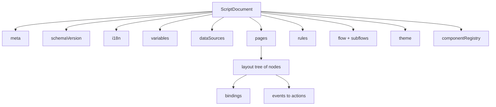
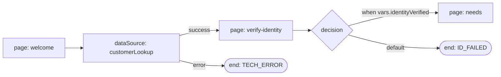

# Verbis Script JSON Model (v1.1)

Related: [DOMAIN](DOMAIN.md) · [ARCHITECTURE](ARCHITECTURE.md) · [SECURITY](SECURITY.md) · [ADR-0006](adr/0006-json-script-model.md) · [ADR-0007](adr/0007-safe-expression-engine.md) · [ADR-0010](adr/0010-script-model-v1.md)

A script version's `document` is a **pure-data JSON document**: no code, no HTML strings, no functions. The only source of truth is **`@verbis/script-schema`** (`packages/script-schema`): zod schemas and their TS types, a JSON Schema export (`schema/script-document.schema.json`), the semantic validator, migrations, tree helpers and sample fixtures. This page summarizes the package; [ADR-0010](adr/0010-script-model-v1.md) records how v1 differs from the earlier draft.

## 1. Top-level shape



```jsonc
{
  "schemaVersion": "1.1.0",                    // only the current version parses; older ones go through migrate()
  "id": "01928f3a-0000-7000-8000-000000000001", // Script id (UUIDv7)
  "meta": { "name": "Tahsilat", "tags": ["collections"], "channels": ["voice"], "capabilities": ["hold"] },
  "variables": [ ... ],
  "dataSources": [ ... ],
  "pages": [ ... ],                            // at least one
  "flow": { ... },                             // main flow; its start node is the entry
  "subflows": [ ... ],                         // targets of runSubflow / subflow nodes
  "rules": [ ... ],
  "theme": { "mode": "inherit", "tokens": { "density": "comfortable" } },
  "i18n": { "defaultLocale": "tr", "messages": { "tr": { "rpc.title": "Kişi teyidi" }, "en": { "rpc.title": "Right party contact" } } },
  "componentRegistry": [ { "type": "acme.creditGauge", "version": "1.2.0", "integrity": "sha384-..." } ]
}
```

Document-level constraints: max size 2 MB, max node depth 32, max 5,000 nodes. Objects are `strict` (no unknown keys). Ids are stable and kebab-case, except that `variables[].key` and `dataSources[].id` are camelCase so expressions can address them. Every reference must resolve (§11).

## 2. Variables

```jsonc
{ "key": "customerName", "type": "string", "scope": "session",
  "classification": "pii", "pii": true, "persist": false, "source": "interaction.attributes.customerName" }
```
- `type`: `string | number | boolean | date | object | array | enum` (`enum` requires `enumValues`). `default` must match `type`.
- `scope`: `session | page | interaction | campaign | global`. `global` holds read-only tenant constants; writing to one is `VARIABLE_READONLY`.
- `classification` (`public | internal | pii | pci`) drives masking, persistence and audit ([DOMAIN](DOMAIN.md#variable)). `pci` may never be `persist: true` and may never flow into log, analytics, platform or display sinks.
- Addressed in expressions as `vars.<key>`. Data source fields are `ds.<id>.<field>`, where field is a mapped output or `status`, `error` or `loading`.

## 3. Data sources (references, not secrets)

```jsonc
{
  "id": "customerLookup",
  "ref": "tenant-datasource:customer-profile",   // tenant DataSource entity (versioned)
  "version": 2,
  "inputs":  { "customerId": { "$expr": "vars.customerId" } },
  "outputs": { "fullName": { "path": "$.data.fullName", "variable": "customerName" }, "segment": { "path": "$.data.segment" } },
  "policy":  { "trigger": "manual", "timeoutMs": 4000, "cacheTtlSec": 60 }
}
```
The browser never sees endpoint credentials, URLs with embedded keys, or raw upstream responses. It sees only the mapped `outputs`. REST, SOAP and GraphQL share this shape. The protocol detail lives in the tenant `DataSource` definition, which only the integration engine executes.

`policy.onFailure` optionally selects `block` (default), `continue`, or `manual` for Agent Desktop
operator recovery. Retry always uses current inputs. Continue/manual must match the pinned script
policy and current writer claim on the server; manual values use mapped non-PCI scalar variables.
Normal type/page/required-read validation remains enforced. Script-authored `onError` actions or
flow error edges continue to handle their own fallback.

## 4. Pages and layout tree

A page is `{ id, name, titleKey?, layout, onEnter[], onLeave[], mandatory, timers[] }`. Its `layout` is a node tree whose root is usually a `box`. Timers are `{ id, durationMs, repeat, autoStart, onElapsed[] }`. Every node has the same envelope:

```jsonc
{
  "id": "btn-lookup",
  "type": "button",                                   // core primitive, library or registered component
  "props":    { "variant": "primary", "labelKey": "welcome.lookup" },   // display text only via *Key props
  "style":    { "base": { "direction": "column", "gap": "md" }, "lg": { "columns": 2 } },  // tokens only
  "a11y":     { "labelKey": "welcome.lookup", "shortcut": "Alt+L" },
  "bindings": [ { "prop": "disabled", "expression": "vars.loading == true" } ],
  "visibleWhen": { "$rule": "r-is-voice" },
  "events": {
    "onPress": [ { "type": "callDataSource", "dataSource": "customerLookup", "onError": [ { "type": "showToast", "messageKey": "lookup.failed", "tone": "danger" } ] },
                 { "type": "setVariable", "variable": "loading", "value": true } ]
  },
  "children": []
}
```

### 4.1 Core primitives (the kernel)

| Primitive | Role | Key props / contracts |
|---|---|---|
| `box` | Layout/container: flex/grid/stack, spacing, scroll, region/landmark role, responsive breakpoints, conditional slots | `direction`, `gap`, `grid`, `wrap`, `scroll`, `role` (landmark), `as` (semantic element allow-list) |
| `button` | Action trigger: label/icon, variants, loading/disabled, keyboard shortcut, confirm | `variant`, `labelKey`, `iconKey`, `confirm`, events: `onPress` |
| `webService` | Data source binding: invokes a DataSource, exposes `status/data/error` to bindings, triggers `onSuccess/onError` | `ds`, `trigger` (`manual|onEnter|onChange|interval`), `debounceMs`, events: `onSuccess`, `onError` |

All higher-level components are **compositions** of these primitives plus a small set of leaf renderers registered in `@verbis/components`. The validator knows them as `BUILTIN_COMPONENT_TYPES`: `text`, `heading`, `scriptText`, `richContent`, `alert`, `divider`, `textInput`, `textArea`, `numberInput`, `maskedInput`, `select`, `radioGroup`, `checkbox`, `datePicker`, `table`, `tabs`, `dispositionPicker`, `timer`. Third-party components use `@verbis/component-sdk` and must appear in `componentRegistry` with an SRI hash; an unknown `type` is `COMPONENT_TYPE_UNKNOWN`. Rich text is stored as a structured AST, not HTML, and is sanitized.

### 4.2 Bindings and conditions

- One-way: `{ "prop": "rows", "expression": "ds.debtInfo.history" }`. The prop is recomputed from the safe expression.
- Two-way: `{ "variable": "customerName" }` (`prop` defaults to `value`) or `{ "prop": "checked", "variable": "consentGiven" }`.
- A prop may be bound only once per node (`BINDING_DUPLICATE_PROP`).
- `visibleWhen` / `enabledWhen` / `requiredWhen`, `conditional.if` and flow edge `when` take `{ "$expr": "…" }` or `{ "$rule": "<rule-id>" }`.
- Action values (`setVariable.value`, inputs, params) are a JSON literal or `{ "$expr": "…" }`.

## 5. Events → Actions

`events` map a component event (`on[A-Z]…`) to an ordered action list. Actions are a **closed, typed set discriminated by `type`**. They can be extended only through platform releases, with a schema change and migration.

| Action | Fields | Purpose |
|---|---|---|
| `setVariable` | `variable, value` | Assign a variable (literal type-checked) |
| `callDataSource` | `dataSource, inputs?, onSuccess?, onError?` | Execute a data source |
| `navigate` | `page` | Go to a page |
| `next` / `back` | — | Follow / reverse the flow |
| `showToast` | `messageKey, tone, params?` | Toast (i18n key) |
| `openModal` / `closeModal` | `page` / — | Render a page in a dialog |
| `validatePage` | `page?, onInvalid?` | Run required/validation checks |
| `submitOutcome` | `outcome, notes?, completion?` | Record the session outcome. `completion: "early"` is an author-declared early exit (wrong party, failed verification, refusal, technical error): it skips the mandatory-page check and only requires that values already entered are valid ([ADR-0047](adr/0047-early-exit-outcomes.md)). Omitted = a completing outcome, which needs every mandatory page visited |
| `setDisposition` | `code, subCode?` | Disposition code |
| `writeBackToPlatform` | `attributes` | Attached data via the connector (capability-gated) |
| `transferHint` | `target, reasonKey?` | Suggest a transfer target |
| `runSubflow` | `flow` | Run a subflow |
| `conditional` | `if, then, else?` | Branch |
| `sequence` / `parallel` | `actions` | Group actions |
| `emitEvent` | `name, payload?` | Analytics/audit-visible event |
| `startTimer` / `stopTimer` | `timer` | Page timers |
| `maskField` | `node, masked` | Mask an on-screen field |
| `logEvent` | `level, event, data?` | Diagnostic SessionEvent |

Rules for actions: no raw URL navigation (page refs are ids), no `window.open`, and no script injection. `pci` variables may not appear in `logEvent`, `emitEvent`, `writeBackToPlatform`, `submitOutcome` or `showToast` values. `pii` sent to log or analytics raises a warning.

## 6. Rules (no-code rule engine)

```jsonc
{
  "id": "r-is-voice",
  "when": { "all": [
    { "fact": "interaction.channel", "op": "eq", "value": "voice" },
    { "any": [ { "fact": "vars.segment", "op": "in", "value": ["gold","platinum"] },
               { "fact": "ds.customerLookup.balance", "op": "gt", "value": 5000 } ] }
  ] },
  "then": [ { "type": "setVariable", "variable": "priorityCustomer", "value": true } ],
  "else": [ { "type": "setVariable", "variable": "priorityCustomer", "value": false } ]
}
```
- Rules are a JSON predicate tree (`all/any/not` + leaf comparisons) — the same format the rule-builder UI edits and the assignment engine uses for campaign targeting.
- Leaf operators: `eq neq gt gte lt lte in notIn contains startsWith matches(safe-regex) exists between before after`.
- A predicate may also be a bare `{ "$expr": "…" }`. Facts are restricted to `vars|ds|interaction|agent|campaign|const` paths. Rules are referenced as `{ "$rule": "<id>" }` from conditions and are re-evaluated reactively, so there is no `runRules` action.
- Power users may use the expression language (`$expr`) inside leaves; it is the **same sandboxed engine** ([ADR-0007](adr/0007-safe-expression-engine.md)).
- Rules are pure (side effects only via `then` actions), terminating, and cost-bounded.

## 7. Flows



```jsonc
{
  "id": "main",
  "start": "n-welcome",
  "nodes": [
    { "id": "n-welcome", "type": "page", "page": "welcome", "position": { "x": 0, "y": 0 } },
    { "id": "n-lookup", "type": "dataSource", "dataSource": "customerLookup" },
    { "id": "n-verified", "type": "decision" },
    { "id": "n-date", "type": "setVariable", "variable": "effectiveDate", "value": { "$expr": "today()" } },
    { "id": "n-otp", "type": "subflow", "flow": "verify-otp" },
    { "id": "n-end", "type": "end", "outcome": "SALE_OK" }
  ],
  "edges": [
    { "id": "e1", "from": "n-welcome", "to": "n-lookup" },
    { "id": "e2", "from": "n-lookup", "to": "n-verified", "port": "success" },
    { "id": "e3", "from": "n-verified", "to": "n-otp", "when": { "$expr": "vars.identityVerified" } },
    { "id": "e4", "from": "n-verified", "to": "n-welcome", "default": true, "maxIterations": 3 }
  ],
  "limits": { "maxSteps": 200 }
}
```
- Node types: `page | decision | dataSource | setVariable | subflow | end`.
- Edges are evaluated in order: `when` conditions first, then the `default` edge. `dataSource` nodes branch on `port`.
- Positions are stored for the designer but ignored at runtime.
- Static analysis rejects these as errors:
  - unbounded cycles (`FLOW_CYCLE`): a loop needs `maxIterations` on one of its edges;
  - recursive subflows (`SUBFLOW_CYCLE`);
  - broken edges (`FLOW_EDGE_BROKEN`);
  - a missing start (`FLOW_START_MISSING`).
- It warns on:
  - unreachable nodes (`FLOW_NODE_UNREACHABLE`);
  - dead ends (`FLOW_DEAD_END`);
  - `dataSource` nodes without an `error` edge (`FLOW_DATASOURCE_NO_ERROR_EDGE`).

## 8. i18n

- `i18n.messages.<locale>.<key>` are flat dictionaries using ICU MessageFormat. All display strings in `props`/`a11y` are **keys**. A literal in `text`, `label`, `title`, `placeholder`, `helperText`, `description`, `content` or `message` is `I18N_LITERAL_TEXT`.
- Every referenced key must exist in `defaultLocale` (`I18N_KEY_MISSING`). Keys missing in other locales are reported per locale (`I18N_TRANSLATION_MISSING`, a warning).
- Resolution order: session locale (interaction language or agent preference) → `i18n.defaultLocale` → key.
- Right-to-left readiness: layout uses logical properties.

## 9. Versioning

- `schemaVersion` (document format): semver; runtime supports current and N-1 via migrators in `@verbis/script-schema`; breaking format change ⇒ ADR + major bump.
- `ScriptVersion.number`: monotonically increasing per script; `checksum` over canonical JSON (sorted keys, no `position` data) recorded on publish and in each Session.
- `componentRegistry` pins third-party component versions with SRI hashes.
- Diff is structural (node-id-keyed tree diff), enabling the version diff UI ([COMPETITIVE](COMPETITIVE.md)).

## 10. Execution semantics & safety

1. Runtime = deterministic interpreter over this JSON; no code is generated or evaluated.
2. Expressions: sandboxed, no I/O, no prototype access, step/size/time-bounded, function allow-list.
3. Every user-visible value flows through React (auto-escaped); rich text via sanitized AST renderer.
4. Data from DataSources is treated as untrusted; never interpreted as markup or expression.
5. Capability gating: an action/component that needs a channel capability not present on the interaction is disabled at runtime and flagged at validation.
6. Debugging: each rule/action emits `SessionEvent`s so the visual debugger can step through and replay.

## 11. Validation, migration and editing API

```ts
import { loadScriptDocument, validateScriptDocument, migrate, moveNode, duplicateNode, applyJsonPatch } from '@verbis/script-schema';

const result = loadScriptDocument(stored);   // migrate → zod → semantic checks
// result.ok, result.document, result.issues: { severity, path: JSON Pointer, code, messageKey, params? }[]
const { document, patches, inversePatches } = moveNode(doc, 'btn-ok', { parentId: 'footer', index: 0 });
```

- **Codes** (`VALIDATION_CODES`, stable): `SCHEMA_INVALID`, `SCHEMA_VERSION_*`, `DUPLICATE_ID`, `PAGE_REF_BROKEN`, `DATASOURCE_REF_BROKEN`, `DATASOURCE_FIELD_UNKNOWN`, `RULE_REF_BROKEN`, `SUBFLOW_REF_BROKEN`, `TIMER_REF_BROKEN`, `NODE_REF_BROKEN`, `VARIABLE_UNDEFINED`, `COMPONENT_TYPE_UNKNOWN`, flow codes (§7), `PAGE_UNREACHABLE`, `VARIABLE_*`, `SENSITIVE_DATA_EXPOSED`, `BINDING_DUPLICATE_PROP`, `I18N_*`, and the limit codes.
- **Messages** come from `messageKey` (`script.validation.<camelCode>`) in `@verbis/i18n` (tr + en).
- **Reachability:** the roots are the main flow and the rules. References from unreachable pages or flow nodes do not make their targets reachable.
- **Migrations:** `migrate(doc)` applies the forward-only chain in `MIGRATIONS` and never mutates its input. Each step has a test. `0.9.0` (this page's earlier draft shape) migrates through `1.0.0` to `1.1.0`.
- **Tree helpers:**
  - `findNode`, `walkNodes`, `insertNode`, `moveNode`, `duplicateNode` (fresh ids, internal `maskField` references remapped) and `removeNode` are pure, immer-based edits.
  - `updateNode` edits a node through an immer recipe.
  - Every edit returns RFC 6902 `patches`/`inversePatches` for undo/redo and audit diff. `applyJsonPatch` replays them.
- **Fixtures** (`@verbis/script-schema/fixtures`):
  - valid scripts: `creditCardSalesScript`, `telecomTariffChangeScript`, `collectionsScript`, `surveyScript`;
  - `BROKEN_FIXTURES`, each with its exact expected codes;
  - `legacyDraftScript` (0.9.0) and `minimalScript()`.


### Screen component catalog (step 27)

The complete built-in catalog, setup and authoring contracts live in [packages/components](../packages/components/README.md). `createComponentRegistry()` adds all screen renderers on the core registry; each definition supplies a strict props schema, translated property-panel metadata and event/binding allowlists. Runtime host hooks remain additive; no document format change is required.

Secure TCKN/VKN/IBAN/PAN controls are write-only; classify their variables as PII/PCI before launch. PAN values are memory-only and cleared on runtime disposal. Repeater child IDs derive from stable item identity; scoped `itemPath` writes never change sibling rows. Rich text is structured data with escaped interpolation, never executable HTML.

Partner types use exact componentRegistry version/integrity pins and the [component SDK](../packages/sdk-component/README.md). Only the authenticated host catalog selects an approved artifact and tenant; script JSON cannot select a bundle URL or executable module. Tenant enablement, authorization and authoritative audit remain server responsibilities.

## 9. Flow authoring in schema 1.1.0

See [ADR-0025](adr/0025-flow-rule-variable-editors.md). An explicit `{id,type:"start"}`
passes through to its successor; `{id,type:"transfer",target,reasonKey?}` executes the existing
transferHint action. End accepts `disposition?` and `completion?` (`"early"`, ADR-0047) in addition to `outcome?`; disposition executes
before outcome. The entry is still `flow.start`, so migration retains legacy page entries.
`flow.designer` optionally stores `groups:[{id,label,nodes}]` and
`notes:[{id,text,position:{x,y}}]`. Designer metadata and positions do not affect semantic checksums.

The designer imports other readable script versions as embedded subflows with fresh IDs and
pinned content. Conflicting dependencies reject the whole operation. Decision branches retain
declaration-order evaluation and a single fallback; the designer rejects duplicate fallbacks.
The no-code builder uses shared predicates for node conditions, decisions and assignment
eligibility before weighted A/B selection. Variable rename rewrites parsed references atomically
and rejects dynamic root lookups. It never rewrites unrelated string literals.
