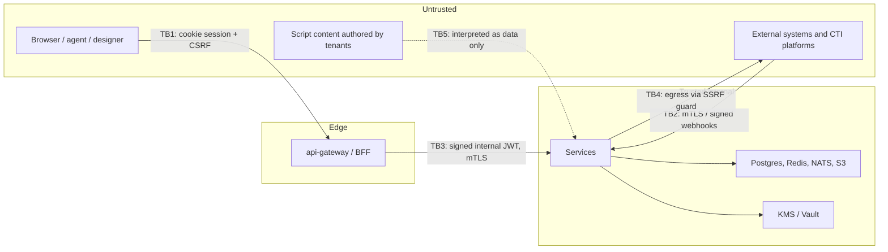
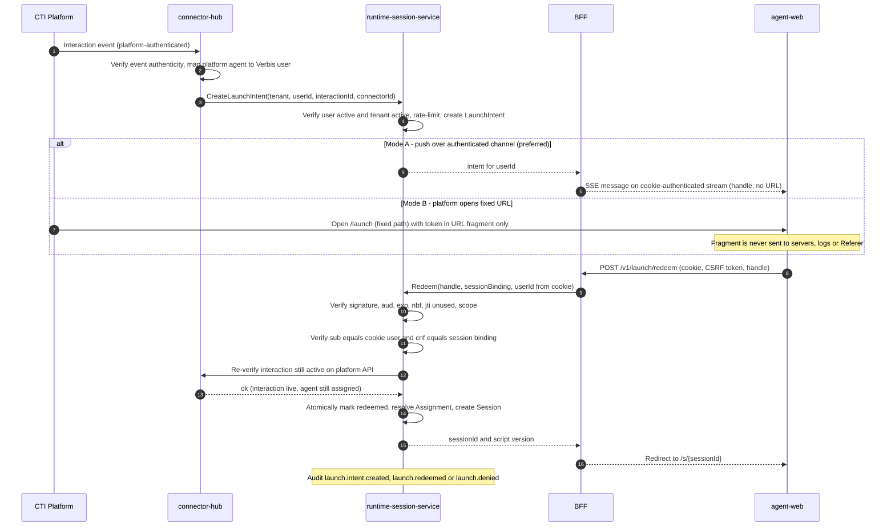

# Verbis Security Design

Related: [ARCHITECTURE](ARCHITECTURE.md) · [DOMAIN](DOMAIN.md) · [SCRIPT_MODEL](SCRIPT_MODEL.md) · [CLAUDE.md](../CLAUDE.md) · [ADR-0004](adr/0004-bff-auth.md) · [ADR-0007](adr/0007-safe-expression-engine.md)

## 1. Security objectives

1. Strict tenant isolation. 2. No credentials or tokens in the browser. 3. Script screens open **only** through a verified, interaction-bound launch. 4. Tamper-evident audit. 5. Safe execution of customer-authored logic. 6. Regulatory readiness: KVKK, GDPR, PCI-DSS (scope minimization).

## 2. Trust boundaries

## 3. Threat model (STRIDE)

| # | Category | Threat | Mitigation |
|---|---|---|---|
| S1 | Spoofing | Attacker opens a script screen as another agent | Secure launch: user-bound token + SSO session binding ([§4](#4-secure-launch-design)) |
| S2 | Spoofing | Forged SAML assertion / OIDC token | Signature validation, audience/issuer/nonce/`InResponseTo` checks, replay cache, clock-skew limit, cert pinning per IdP |
| S3 | Spoofing | Rogue connector/webhook posts fake interaction events | mTLS or HMAC-signed webhooks with timestamp + nonce; per-connector credentials; source IP allow-list option |
| S4 | Spoofing | Stolen session cookie | `__Host-` prefix, httpOnly, Secure, SameSite=Lax/Strict, short idle/absolute timeouts, rotation on privilege change, device-bound fingerprint soft signal, concurrent-session policy |
| T1 | Tampering | Modify published script | Published versions immutable; checksum recorded in audit and each Session; DB permissions deny UPDATE on published rows |
| T2 | Tampering | Edit/delete audit records | Append-only, hash chain, no UPDATE/DELETE grants, WORM anchors, verify API ([§7](#7-audit-integrity)) |
| T3 | Tampering | Parameter tampering to read other tenants' data | RLS, tenant from authenticated context only, ABAC checks, IDs unguessable (UUIDv7 + authorization, never obscurity) |
| T4 | Tampering | Malicious expression/rule | Safe expression engine, bounded evaluation, no eval ([ADR-0007](adr/0007-safe-expression-engine.md)) |
| R1 | Repudiation | User denies action | Audit event for every mutation, actor+IP+session+correlation; clock sync (NTP) and server-side timestamps only |
| I1 | Info disclosure | Secrets leak to browser | Secrets only in server Secret store; integration-engine proxy; responses mapped/redacted; secrets write-only |
| I2 | Info disclosure | PII in logs/analytics | Classification tags + pino redaction + audit diff redaction + analytics pseudonymization |
| I3 | Info disclosure | SSRF reaching metadata/internal services | SSRF guard ([§5.1](#51-ssrf)) |
| I4 | Info disclosure | Cross-tenant cache/key bleed | Tenant-prefixed cache keys, per-tenant data keys, RLS tests in CI |
| D1 | DoS | Expensive web service/rule loops | Timeouts, size limits, step budgets, rate limits per tenant/user/IP, bulkheads, queue backpressure |
| D2 | DoS | Launch token flooding | Per-user/interaction rate limit, intent TTL, capped pending intents |
| E1 | Elevation | Agent calls designer/admin APIs | CASL RBAC+ABAC on every endpoint, deny-by-default, separate scopes per app |
| E2 | Elevation | Malicious third-party component | SDK sandbox (iframe `sandbox`, CSP, postMessage schema), SRI pinning, publisher review, capability manifest |
| E3 | Elevation | XSS leading to action as the agent | CSP, no HTML injection ([§5.2](#52-xss)), BFF cookies not readable by JS, CSRF protection, action allow-list |

## 4. Secure launch design

**Requirement:** neither agent nor any user can open a script screen from outside by crafting a URL or URL parameters. A script session can only start from a **signed, single-use, short-lived launch token that is bound to the interaction and to the user**, and **verified against the platform API**.

### 4.1 Rules

1. **No parameter-driven routes.** There is no route like `/agent?script=…&campaign=…&interaction=…`. The agent app route is a fixed path (`/launch` → `/s/{sessionId}`). Any query parameter naming script/campaign/user/interaction is ignored and logged as a security signal; they never select content.
2. **Script is resolved server-side** by the Assignment engine from verified interaction attributes at redemption time — never chosen by the client.
3. **Sessions are created only by `redeem`.** There is no "create session" API for end users.
4. `/s/{sessionId}` access requires: valid BFF session cookie **and** `session.userId == cookie.userId` **and** session state active. A leaked sessionId URL is useless to anyone else.

### 4.2 Token

> **Superseded in part by [ADR-0017](adr/0017-secure-launch.md):** the launch handle is an opaque 256-bit code whose hash binds a server-side `LaunchIntent`; no self-contained launch token is minted. The checks below are applied to the intent. CTI-less launchers sign a JWS with a tenant-registered key (ADR-0017 §2).

Token = EdDSA (Ed25519) signed compact token (or PASETO v4.public) minted by runtime-session-service; keys in KMS, rotated, `kid` header, tenant-scoped audience.

| Claim | Meaning |
|---|---|
| `iss` / `aud` | `verbis-runtime` / `agent-web:{tenantId}` |
| `jti` | Random 128-bit; **single use** (Redis `SET NX` with TTL; also persisted in `launch_intents` for forensics) |
| `iat` / `nbf` / `exp` | Lifetime ≤ **60 s** (configurable ≤ 120 s); clock skew ≤ 5 s |
| `tnt` | Tenant id |
| `sub` | Verbis user id the launch is for |
| `int` | Interaction id (platform-verified) |
| `con` | Connector id that attested the interaction |
| `cnf` | Binding: hash of the user's BFF session id (and optional device/TLS-channel binding) |
| `scp` | `launch:redeem` only |
| `rid` | Reference to server-side `LaunchIntent` record |

The token is a **handle plus proof**; authoritative state lives in the server-side `LaunchIntent` (`pending | redeemed | expired | revoked`). Redemption re-validates everything server-side — signature alone is never sufficient.

### 4.3 Flow

### 4.4 Verification checklist (all must pass; fail closed)

1. Signature valid, `kid` known, algorithm pinned (no `alg` negotiation).
2. `aud`, `iss`, `scp`, `tnt` match the request tenant (derived from host, not input).
3. `nbf ≤ now < exp`, TTL not exceeding max.
4. `jti` not seen; consume atomically (Lua/`SET NX`); replay ⇒ deny + alert + audit.
5. `sub` equals the authenticated BFF session user; `cnf` equals current session binding.
6. LaunchIntent exists, `pending`, not revoked; user still `active`.
7. **Platform API verification**: connector confirms interaction exists, is live, and the user's CTI identity is a current participant/assigned agent. For CTI-less mode, an explicit tenant-configured trusted launcher (signed by tenant-registered service credential) replaces this check.
8. Assignment resolved server-side; no assignment ⇒ deny with RFC 7807 problem (`VERBIS_LAUNCH_NO_ASSIGNMENT`).
9. Rate limits: per user, per interaction, per IP.

### 4.5 Hardening

- Token never logged (redaction on `lt`, `Authorization`, fragment never reaches servers).
- `Referrer-Policy: no-referrer`; fragment scrubbed with `history.replaceState` immediately after read.
- Revocation: interaction ended, agent logout, SCIM deactivation, or admin action ⇒ intent revoked and live sessions terminated via event.
- Re-launch for the same interaction (e.g. reconnect) creates a **new** intent; previous session is resumed only if bound to the same user and still active.
- Embedding: agent-web allows framing only by tenant-configured origins (`frame-ancestors`); `SameSite` third-party cookie constraints handled with partitioned cookies (CHIPS) or top-level popup fallback.
- Designer "preview/test run" uses a distinct `preview` session type: requires designer permission, runs against sandbox/mock data sources, marked in audit, never attached to a real interaction.

## 5. Application security controls

### 5.1 SSRF

Applies to integration-engine and any server-side fetch (IdP metadata, webhooks, SIEM, OIDC discovery).
- Egress **allow-list per tenant/DataSource** (host + port + scheme); default deny.
- Resolve DNS server-side, validate **resolved IPs** against deny-list (loopback, link-local `169.254.0.0/16` incl. cloud metadata, RFC1918, CGNAT, ULA, multicast, IPv4-mapped IPv6), then **connect to the pinned IP** (defeats DNS rebinding); re-validate on every redirect or disable redirects.
- Only `https` by default (`http` per explicit tenant exception for on-prem); block `file:`, `gopher:`, etc.; restrict ports.
- User-controlled parts of URL are limited to path/query templates with encoding; host never templated from user input.
- Response size/time caps; no reflection of upstream error bodies to clients.
- Egress via dedicated NAT/proxy with network policy; metadata endpoints blocked at network level too (IMDSv2 required).

### 5.2 XSS

- React auto-escaping; **no `dangerouslySetInnerHTML`** (lint-banned); rich text is a structured AST rendered by a sanitizing renderer (allow-list of nodes/attrs, URL scheme allow-list).
- Strict CSP: `default-src 'self'`; `script-src 'self'` with nonces/hashes, no `unsafe-inline`/`unsafe-eval`; `object-src 'none'`; `base-uri 'none'`; `frame-ancestors` per tenant allow-list; `form-action 'self'`; Trusted Types enforced.
- Script content (labels, rich text, data source results) is data, never code; expression engine has no DOM access.
- Third-party SDK components run in sandboxed iframes with a postMessage contract.
- Other headers: HSTS (preload), `X-Content-Type-Options: nosniff`, COOP/COEP/CORP where feasible, `Permissions-Policy` minimal.

### 5.3 CSRF

- SameSite cookies + **double-submit/synchronizer token** (per-session, header `X-CSRF-Token`) on all state-changing requests; `Origin`/`Sec-Fetch-Site` validation at BFF; CORS allow-list (no wildcard with credentials); JSON-only content types for mutations.

### 5.4 AuthN / sessions

- OIDC Authorization Code + PKCE, `state` + `nonce`; token endpoint auth `private_key_jwt`/`client_secret_basic`; ID token validation per spec; back-channel logout supported.
- SAML 2.0: signed assertions (and/or responses) required, `InResponseTo` binding, `NotOnOrAfter`, audience restriction, one-time assertion ID cache, XML signature wrapping defenses (library-validated, schemas strict), encrypted assertions supported; SP metadata per tenant; SLO.
- Tokens from IdPs are held **server-side** in the BFF session store (Redis, encrypted); the browser only has an opaque session cookie ([ADR-0004](adr/0004-bff-auth.md)).
- MFA is delegated to the IdP; step-up supported (`acr`/`amr` checks) for sensitive actions (publish, secret write, audit export).
- SCIM 2.0: bearer credential per IdP/tenant (hashed at rest, rotatable, IP allow-list option), strict filter parsing, rate limits, full audit.
- **Implementation (prompt 4, [ADR-0012](adr/0012-identity-module.md))** in `apps/api/src/modules/identity`:
  - Session cookie `__Host-verbis_session` (httpOnly, Secure, SameSite=Lax|Strict); sealed Redis record (AES-256-GCM, AAD-bound, kid rotation); idle + absolute timeouts; per-user concurrent limit (`evict_oldest` | `deny`); users list/end their sessions, admins end anyone's.
  - CSRF on cookie mutations: `X-CSRF-Token` (synchronizer, from `GET /auth/session`) + allow-listed `Origin`/`Sec-Fetch-Site` + JSON-only bodies.
  - OIDC: PKCE S256, state, nonce, id_token validation, refresh-token rotation (refused refresh ends the session), RP-initiated, back-channel (signed logout token, single-use `jti`) and front-channel logout. IdP egress: https-only, connect-time IP validation (DNS rebinding), no redirects.
  - SAML: signed assertions mandatory, issuer/audience/time/InResponseTo checks, single-use assertion ids, transient NameIDs refused, optional mandatory encryption, IdP-initiated off unless enabled per IdP, SP certificate rotation (`next` → `active` → `retired`), SLO.
  - Break-glass: argon2id + TOTP (replay-protected), admin-web origin only, origin-bound short session, lockout, every attempt a `severity: critical` audit event + alert event.
  - Service clients: OAuth 2.0 client credentials (`client_secret_basic|post`, `tls_client_auth`), certificate-bound tokens (RFC 8705), no permission escalation.
  - Error formats: SCIM (RFC 7644) and token endpoint (RFC 6749) use their standard formats; everything else RFC 7807.

### 5.5 AuthZ

Deny-by-default CASL policies, evaluated server-side on every request; object-level checks (ABAC: tenant, campaign, team, classification). Frontend ability hints are UX only. Policy unit tests per role matrix in CI.

### 5.6 Injection & input

zod validation at every boundary; parameterized queries only (Prisma; raw SQL reviewed); XML parsing hardened (no DTD/external entities) for SOAP/SAML; GraphQL depth/complexity limits and operation allow-lists; file uploads: type sniffing, size caps, AV scan hook, stored in S3 with random keys and served from a separate origin.

### 5.7 Secrets management

Envelope encryption (AES-256-GCM data keys wrapped by KMS/Vault per tenant); write-only API; rotation + versioning; usage audited; pre-commit + CI secret scanning; no secrets in env of the browser build; in-memory only during use; zeroization where feasible.

### 5.8 Supply chain & infra

Lockfile + pinned versions, `pnpm audit`, SBOM (CycloneDX), signed images (cosign), minimal distroless images, non-root, read-only FS, NetworkPolicies, Renovate with review, SAST/DAST in CI, dependency license policy.

## 6. PII & data protection (KVKK / GDPR / PCI-DSS)

### 6.1 Classification

| Class | Examples | Handling |
|---|---|---|
| `public` | UI labels | none |
| `internal` | Campaign names | normal |
| `pii` | Name, phone, email, national ID, address | encrypted at rest, masked by default in UI/logs, access audited, retention-limited |
| `sensitive` (KVKK özel nitelikli / GDPR special) | Health, biometrics | explicit lawful basis, restricted roles, stricter retention |
| `pci` | PAN, CVV, expiry | **never stored/logged**; see §6.4 |
| `secret` | API keys, passwords | Secret store only; never returned |

### 6.2 Controls

- Classification at schema level (`@pii/@pci/@secret`) and on script `Variable.classification`; automatic redaction in logs, audit diffs, SessionEvent payloads, analytics.
- **Data minimization:** CTI attached data mapped only to declared variables; session variables persisted only if classification permits; configurable retention per class with scheduled purge jobs (BullMQ) producing audit events.
- **Encryption:** TLS 1.2+ (1.3 preferred) in transit incl. internal mTLS; at rest via disk + application-level field encryption for `pii`/`sensitive` with per-tenant keys; backups encrypted.
- **Data subject rights:** DSAR export, rectification, erasure/anonymization workflows across Postgres, S3, analytics; legal hold support; audit chain retains **pseudonymized actor references** and hashes only (no raw PII) so erasure does not break integrity.
- **Residency:** tenant region pinning; no cross-region replication of PII unless configured.
- **Records of processing:** machine-readable data inventory generated from schema tags; DPIA template; breach-notification runbook (KVKK 72h / GDPR 72h).
- **Consent/purpose:** purpose tags on data sources and variables; access outside purpose denied by ABAC.
- **Access:** just-in-time elevated access for support with approval + time-boxed + audited; no standing production data access.

### 6.3 Masking in UI

Masked by default (`•••• 1234`); "reveal" is permission-gated, time-boxed, rate-limited, and audited (`pii.reveal`). Copy-to-clipboard of masked data disabled unless permitted.

### 6.4 PCI-DSS scope reduction

- Verbis **does not store, process-to-persist, or log PAN/CVV**. Payment capture uses either (a) a hosted fields/iframe from a PCI-validated PSP, (b) DTMF masking / pause-and-resume via the telephony platform, or (c) tokenization data sources where only tokens flow through Verbis.
- `pci` variables accept only signed hosted-capture receipts. The verified token reference is tenant/session-envelope encrypted for replica/cache-loss recovery; raw PAN/CVV remain forbidden. References are redacted from browser views, excluded from SessionEvent/audit/log/analytics, and cleared on page leave/session end ([ADR-0039](adr/0039-runtime-io-and-payment-token-recovery.md)).
- Segmentation: payment-related connectors run in an isolated deployment profile; quarterly ASV scans and annual pentest planned (see [PROGRESS](PROGRESS.md) step 35).
- Mapped controls: req 3 (no storage), 4 (TLS), 6 (secure SDLC, SAST/DAST), 7/8 (RBAC, MFA via IdP), 10 (audit logging, time sync, chain integrity), 11 (testing), 12 (policies).

## 7. Audit integrity

- Per-tenant chain: `hash_n = SHA-256( hash_{n-1} ‖ canonical_json(event_n) )`; gap-free `seq` assigned by the sequencer inside a serializable section.
- Storage: append-only table (no UPDATE/DELETE privilege, trigger blocks), partitioned by time, replicated; periodic **signed checkpoints** (Ed25519 over `(tenant, seq, hash)`) written to WORM object storage (S3 Object Lock) and optionally external timestamp (RFC 3161).
- `GET /v1/audit/verify?from&to` recomputes the chain and checkpoints; any break raises a P1 alert and is itself audited.
- Search: indexed by actor, action, target, time range, outcome, correlationId; role-gated (`auditor`); reads of audit data are audited.
- SIEM export: streaming (syslog TLS/CEF, JSON over HTTPS webhook, S3/Kafka-compatible sink), at-least-once with idempotency key `(tenant, seq)`, signed batches; exporter configuration is a secured, audited setting.
- Retention configurable (default 24 months online, 7 years archived for regulated tenants); legal hold.

## 8. Logging, monitoring & incident response

- Structured pino logs, trace-correlated; security events (`launch.denied`, auth failures, authz denials, SSRF blocks, chain verification failures, rate-limit trips) feed alert rules (Prometheus/Alertmanager) and the SIEM stream.
- Runbooks: token/key compromise (rotate `kid`, revoke intents), IdP compromise (disable IdP, kill sessions), tenant breach, audit chain break.
- Backups tested quarterly; DR drills; chaos tests on NATS/Redis loss (launch fails closed).

## 9. Security testing

Unit/property tests for token verification, SSRF guard, expression engine, hash chain; Playwright security e2e (direct URL open attempts must fail); fuzzing of parsers (SAML/SOAP/rule JSON); SAST (CodeQL/Semgrep), DAST (ZAP) in CI; k6 abuse scenarios; external pentest before GA ([PROGRESS](PROGRESS.md) step 35).

## 10. ASVS 4.0.3 uygulama kanıtı ve release gate

Yukarıdaki hedef mimari maddeleri otomatik olarak uygulanmış/sertifikalı sayılmaz.
Güncel madde envanteri [security/ASVS_CHECKLIST.md](security/ASVS_CHECKLIST.md),
kurulum ve operasyonel sınırlar [security/OPERATIONS.md](security/OPERATIONS.md),
pentest kapsamı [security/PENTEST_CHECKLIST.md](security/PENTEST_CHECKLIST.md),
KVKK veri envanteri [compliance/KVKK.md](compliance/KVKK.md) dosyalarındadır.
Adım 35 test ve taramaları yazılmıştır; kullanıcı talimatıyla bu görevde çalıştırılmamıştır.
Secure fields artık raw PCI değeri yerine hosted capture receipt kabul eder;
konfigürasyon yoksa giriş kapalıdır. Geçmiş bellekte raw PCI yakalama tasarımı
production capture için kullanılmaz. ASVS uygunluk iddiası tüm uygulanabilir satırlar
ve dağıtım/IdP/KMS/PSP/bağımsız pentest kanıtları tamamlanmadan yapılamaz.

### Forwarded mTLS proof and private data access (2026-10-06)

A forwarded client certificate is public data, not authentication. When `MTLS_CLIENT_CERT_HEADER`
is configured, the API requires `x-verbis-mtls-proxy-secret` matching `MTLS_PROXY_SECRET`
(at least 32 random characters, constant-time comparison). The verified TLS edge overwrites both
headers; public routes remove them. The proof stays between edge and API. Native authorized TLS
sockets remain the certificate source when forwarding is disabled. See
[private gateway setup](integrations/PRIVATE_EGRESS.md) for edge provisioning and rotation.

Private egress is an explicit outbound-only worker with tenant/client/certificate-bound pulls,
one-use leases, encrypted transient Redis payloads and worker-local origin/CIDR/query catalogs.
Core public SSRF checks remain in force. SQL uses an operator catalog, separate local credentials,
read-only transactions, positional parameters and bounded results. The
[verification record](verification/DATA_ACCESS_2026-10-06.md) lists the PCI canary's actual store coverage
and the remaining production/vendor acceptance.
